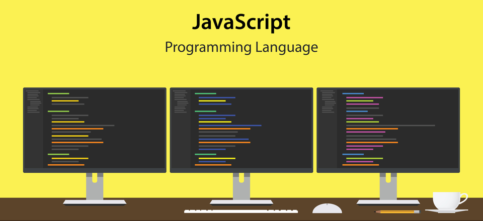

# Javascript desde 0 - código 69938 

> Curso Javascript desde 0 |  
> Martes, Miércoles y Viernes de 13:30hs a 16:30hs |  
> desde el 06/09/2023 al 19/09/2023  |  
> Código 69938 |  
> sensei: Marcos Pinardi |  

1. Definición
2. ¿Qué puede hacer javascript?
3. Requisitos de software
4. Ejecutar Javascript

## 1. Definición

> Javascript es un lenguaje de programación desarrollado inicialmente para la web. Para FRONTEND. Para gestionar la interactividad en una web.

## 2. ¿Qué puede hacer javascript?

> Javascript puede reescribir el DOM.  
> Podemos modificar características o atributos de un elemento.
> Podemos modificar el contenido de un elemento.     
> Podemos crear un elemento "a pedido".

## 3. Requisitos de software

> Un browser.  
> Un editor (programa para programar).

a. Visual Studio Code https://code.visualstudio.com/  
b. Sublime text. https://www.sublimetext.com/   
c. Brackets http://brackets.io/
e. Playcode https://playcode.io/  
f. Codeanywhere https://codeanywhere.com/  

## 4. Ejecutar Javascript
a. Se puede escribir código javascript como script de terminal. O sea que escribo comandos que se pueden ejecutar en terminal de sistema  
b. Se puede ejecutar javascript en la consola del browser.  
c. Se puede insertar dentro del elemento "<script>"    
d. También se puede generar código javascript en línea (inline). Esto es como varlor de un atributo controlador de eventos de HTML

----

